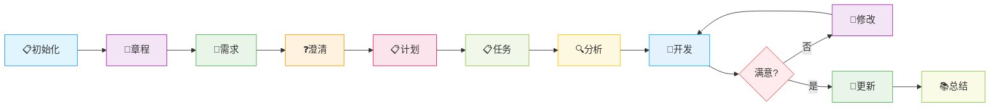

# 🚀 Cursor结合Spec-Kit的使用指南

> 本指南将帮助您掌握使用Cursor结合Spec-Kit进行项目开发的完整流程，从初始化到最终实现的全过程。

## 🎯 工作流程概览



---

## 📋 初始化
```shell
# 已有项目初始化
# 打开项目
specify init
# 新项目初始化
specify init [项目名]
```
## 📜 项目章程

> **重要**：项目章程定义了开发过程中必须严格遵守的规则和边界，是整个项目的基础约束。

```shell
# 你需要检查生成的章程文件
/constitution 当前项目必须要严格遵守的内容、边界（如：密码等敏感信息需要加密存储，变量命名是驼峰还是下划线、SQL语句严格遵守MySQL语法还是PostgreSQL等，可以不断完善补充。）

# 也可以像这样填写，这是官方视频的示例
/constitution Fill the constitution with the bare minimum requirements for a static web app based on the template.

# 翻译后
/constitution 基于最低限度的静态网页应用程序的模板，来填写章程文件
```

### 💡 章程内容建议
- 🔐 **安全规范**：密码等敏感信息加密存储
- 📝 **编码规范**：变量命名规则（驼峰/下划线）
- 🗄️ **数据库规范**：SQL语法标准（MySQL/PostgreSQL）
- 🏗️ **架构约束**：技术栈选择限制
## 📝 详细说明（需求描述）

> **目标**：明确项目需求，生成规范的需求文档，为后续开发提供清晰指导。

```shell
# 会自动新建一个分支，并在分支上生成一些md文件，记录需求内容。需要关注的是生成的spec.md文件的内容
/specify 新的需求内容是什么？为什么？（不涉及如何实现，使用什么技术栈）
```

### ✅ 需求描述示例

#### 🎯 好例子（用户导向）
> 关注用户体验和业务价值

- ✅ "用户可以在3分钟内完成结账"
- ✅ "系统支持10000个并发用户"
- ✅ "95%的搜索在1秒内返回结果"
- ✅ "任务完成率提高40%"

#### ❌ 坏例子（技术导向）
> 避免过于技术化的描述

- ❌ "API响应时间小于200ms"（过于技术性，请使用"用户立即看到结果"）
- ❌ "数据库可以处理1000 TPS"（实施细节，使用面向用户的指标）
- ❌ "React组件高效渲染"（特定于框架）
- ❌ "Redis缓存命中率超过80%"（技术特定）

### 🔧 修改需求文档
当生成的需求文档中，存在需要修改的内容时：
```shell
#（选中spec.md文件）
@spec.md 描述你需要修改的内容
```
## ❓ 阐明问题

> **目的**：通过AI提问来消除需求中的歧义，确保项目目标清晰明确。

```shell
# AI会返回一些它觉得不确定或必要的问题，你需要回答，来明确需求中的歧义或缺失的决策点，并记录问题和结果到需求文档spec.md文件中。
/clarify 可选，可以输入一些你重点关注的内容，比如性能瓶颈风险
```

### 🎯 重点关注领域
- 🚀 **性能要求**：响应时间、并发量等
- 🔒 **安全考虑**：数据保护、权限控制
- 📱 **用户体验**：界面友好性、操作流程
- 🏗️ **技术约束**：兼容性、扩展性

---

## 📋 实现计划

> **目标**：制定详细的技术实现方案，为开发团队提供清晰的实施路径。

```shell
# 将会生成一个plan.md文件，记录了完整的实现方案。你需要检查方案内容是否符合预期，是否有需要修改内容
/plan 如何实现？或对实现有什么要求？如：要使用什么技术栈、要复用代码中某部分已实现的功能、是否要生成测试代码之类的，如果有表结构之类的SQL语句，也可以输入在这里

# 当生成的方案文档中，存在需要修改的内容时
#（选中plan.md文件）
@plan.md 描述你需要修改的内容
```

### 📝 计划内容包含
- 🛠️ **技术栈选择**：框架、库、工具链
- 🏗️ **架构设计**：系统结构、模块划分
- 🗄️ **数据库设计**：表结构、索引策略
- 🧪 **测试策略**：单元测试、集成测试
## 📋 拆分任务

> **目标**：将复杂的实现计划分解为可管理的小任务，便于团队协作和进度跟踪。

```shell
# 将会生成一个tasks.md文件，记录了拆分后的任务步骤。你需要检查每项任务步骤是否正确，是否有多余步骤，是否缺少步骤，步骤内容是否需要修改
/tasks

# 当需要修改任务步骤时
#（选中tasks.md文件）
@tasks.md 描述你需要修改的内容
```

### ✅ 任务检查清单
- [ ] 任务步骤是否完整
- [ ] 是否有重复或多余步骤
- [ ] 任务依赖关系是否清晰
- [ ] 任务描述是否具体可执行
- [ ] 预估工作量是否合理

---

## 🔍 分析

> **目的**：全面检查项目文档的一致性，识别潜在风险和冲突点。

```shell
# 命令会读取spec.md, plan.md, tasks.md， constitution.md文档，检查文档中前后矛盾或冲突的部分、潜在风险内容
/analyze

# 如果有冲突，直接在对话中描述需要修改的内容
描述你需要修改的内容
```

### 🚨 检查重点
- ⚠️ **文档一致性**：需求与计划是否匹配
- 🔄 **逻辑冲突**：任务间是否存在矛盾
- 🎯 **目标对齐**：实现方案是否符合需求
- ⏰ **时间规划**：任务安排是否合理
## 🚀 实现（开发）

> **核心阶段**：基于前期规划，开始实际的代码开发和功能实现。

```shell
# 开发实现
/implement

# 当最终实现经常没有满足要求时
直接在对话中描述需要修改的内容，直到功能实现，并符合期望
```

### 📝 更新需求文档
当最终实现符合预期后，更新需求文档：
```shell
# 总结对话历史，更新需求文档
Based on the conversation, encode the learnings and the experience pieces (NOT THE TECHNICAL DETAILS) into @spec.md for the current feature.
```

---

## 📚 总结并记录经验

> **持续改进**：将开发过程中的经验教训转化为可复用的功能需求。

```shell
# 总结经验
Let's transform the learnings into relevant functional requirements in the spec.
```

---

<div align="center">

**🎉 恭喜！您已经掌握了Cursor结合Spec-Kit的完整开发流程**

*持续实践，让AI成为您最得力的开发伙伴！*

</div>
